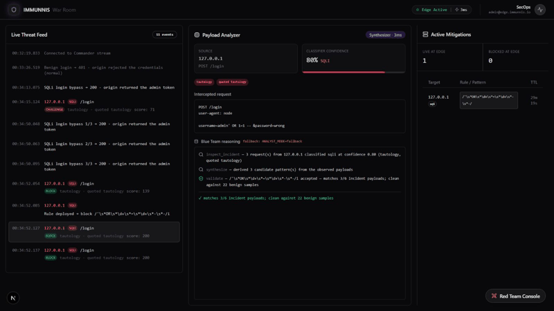
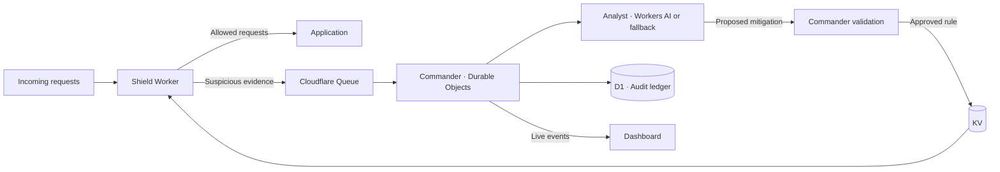

<div align="center">

# Immunis

**An autonomous defense agent that investigates suspicious traffic and deploys temporary protections while developers fix the underlying vulnerability.**

[](https://developers.cloudflare.com/workers/)
[](https://developers.cloudflare.com/workers-ai/)
[](https://www.typescriptlang.org/)
[](https://nextjs.org/)

[Watch Demo](https://youtu.be/5-JEJ8wvWRo) · [Quick Start](#-quick-start) · [Report Bug](https://github.com/KirstenSotelo/Immunis/issues)

<a href="https://youtu.be/5-JEJ8wvWRo">
  
</a>

*Observe the attack. Investigate the evidence. Validate and enforce a response.*

<a href="https://youtu.be/5-JEJ8wvWRo">
  
</a>

<sub>Recorded locally with the fallback synthesizer and scripted Red Agent. No live Workers AI inference is shown.</sub>

</div>

---

## 🛡️ Overview

Immunis is an application defense prototype built on Cloudflare. It remembers suspicious activity, investigates incidents, and publishes temporary request-filtering rules. The dashboard shows the evidence and decisions behind each response.

**The Red Agent is separate testing tooling.** It challenges the defense with changing payloads; it is not part of the protection a website needs to run.

## ⚡ At a Glance

| Capability | What Immunis delivers |
|---|---|
| **8 threat categories** | Recognizes signatures across injection, traversal, SSRF, Log4Shell and scanning activity—full list below. |
| **2 analysis paths** | A Workers AI Analyst with tool use and validation feedback, plus deterministic rule synthesis when AI is unavailable. |
| **4-stage threat scoring** | Observe → monitor → challenge → block, backed by incident history, score decay and repeat-offender escalation. |
| **Cross-IP campaign detection** | Correlates shared attack fingerprints across addresses to identify distributed activity. |
| **6 Cloudflare services integrated** | Workers, Workers AI, Durable Objects, Queues, KV and D1 power execution, inference, state, background analysis, rules and audit history. |
| **57 passing automated tests** | Covers Analyst behavior, Shield enforcement, rule synthesis and campaign policy with scripted models and mocked bindings. |
| **Validation and revision** | Checks proposed patterns against attack and benign samples, returning rejection feedback for the Analyst to revise its proposal. |
| **Temporary protection with visible decisions** | Publishes expiring Shield rules and streams captured evidence, analysis steps, validation results and edge-block events to the dashboard. |

**Recognized threat categories:** SQL injection, cross-site scripting (XSS), path traversal, remote command execution patterns, server-side request forgery (SSRF), NoSQL injection, Log4Shell patterns and scanner signatures.

*These describe implemented capabilities and classifier coverage, not guaranteed prevention. Scoring stages are policy states; Shield currently enforces blocking actions. The demo executes real SQL injection, while additional attack outcomes are simulated.*

## 🏗️ Architecture



The Analyst proposes; Commander controls deployment. **Shield enforces the rules**—the application’s source code stays unchanged.

## 🛠️ Tech Stack

| Layer | Technologies |
|---|---|
| **Defense backend** | Cloudflare Workers, Durable Objects, Queues, KV, D1 |
| **AI** | Workers AI · Llama 3.3 70B |
| **Dashboard** | Next.js, React, TypeScript, Tailwind CSS |
| **Practice target** | Express, SQLite |

## 🚀 Quick Start

<details>
<summary><strong>Expand local setup</strong></summary>

You’ll need **Node.js 24** and npm (the tests use Node's TypeScript and SQLite support). Keep the deliberately vulnerable target in a controlled local environment.

```sh
git clone https://github.com/KirstenSotelo/Immunis.git
cd Immunis
```

Open three terminals at the repository root.

**1. Practice target — port 3001**

```sh
cd apps/target
npm ci
npm start
```

**2. Defense engine — port 8787**

Copy `apps/orchestrator/.dev.vars.example` to `apps/orchestrator/.dev.vars`. Set `ANALYST_MODE="fallback"` for deterministic defensive analysis.

```sh
cd apps/orchestrator
npm ci
npm run db:init
npm run dev
```

**3. Dashboard — port 3000**

```sh
cd apps/dashboard
npm ci
npm run dev
```

Open **http://127.0.0.1:3000**. Stop each service with `Ctrl+C`.

For a different engine address, see `apps/dashboard/.env.example`. The current dashboard assumes a local Commander without an API key; authenticated dashboard access remains follow-up work.

**Run the checks**

From `apps/orchestrator`, run `npm test` and `npm run typecheck`. From `apps/dashboard`, run `npm run typecheck` and `npm run build`. Tests use scripted models and mocked Cloudflare bindings, not live AI.

</details>

### Try the defense

In **Red Team Console**:

1. **Benign login** → `401` from the application.
2. **Burst ×3** → watch Immunis investigate and publish a rule.
3. **SQLi attack** → `403` from Shield after protection activates.
4. **Benign login** → verify the normal request still reaches the application.
5. **Reset demo** → start again.

**Botnet ×4** tests correlation across simulated addresses. **Unleash AI** starts the adaptive attacker, with a scripted fallback. **Terminate** stops it.

## 📁 Project Structure

```text
apps/
├── orchestrator/   # Shield, Commander, Analyst, and Cloudflare bindings
├── dashboard/      # Live evidence, mitigations, and demo controls
└── target/         # Deliberately vulnerable practice application
docs/
├── PROJECT_BRIEF.md
└── assets/         # Animated demo preview
```

## 🔎 Prototype Scope

- Protection is temporary filtering, not source-code repair or general zero-day detection.
- SQL injection is real against the practice database; additional attack classes use simulated outcomes.
- Validation covers selected samples. Extended testing found an overly broad rule that also blocked benign traffic.
- Application-specific replay, stronger validation, and live AI evaluation are next priorities.

See the [engineering brief](docs/PROJECT_BRIEF.md) for implementation and testing details.

---

<div align="center">
  <sub>Built at Hack the North · Investigate. Validate. Protect.</sub>
</div>
